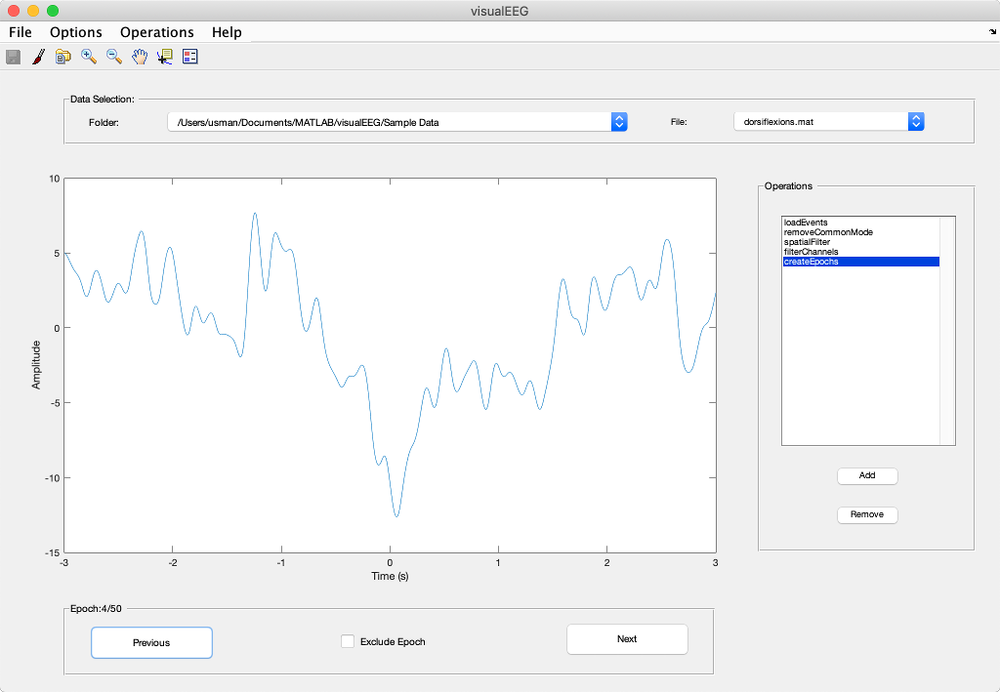

# visualEEG

[](https://gitter.im/GallVp/visualEEG?utm_source=badge&utm_medium=badge&utm_campaign=pr-badge&utm_content=badge)

visualEEG is a MATLAB/GUIDE based toolbox which can be used for very basic analysis of EEG/EMG data. The goal of this project is to develop a single window interactive tool.

<p align="center">
<hr>
<em>Fig 1. The main GUI window of visualEEG which allows an interactive processing of data.</em>
</p>

## Source Code and Tutorials related to Publications

1. [README](https://github.com/GallVp/visualEEG/tree/master/libs/libMRCP) for "Automated Labeling of Movement-Related Cortical Potentials using Segmented Regression", *IEEE Transactions on Neural Systems and Rehabilitation Engineering*, doi: [10.1109/TNSRE.2019.2913880](http://dx.doi.org/10.1109/TNSRE.2019.2913880)

## Tutorials

Following tutorials are available.

<ul>
    <li>
        <a href="https://github.com/GallVp/visualEEG/tree/master/docs/README.md">Overview of visualEEG</a>
    </li>
    <li>
        <a href="https://github.com/GallVp/visualEEG/tree/master/docs/importTutorial.md">How to Import Data in visualEEG?</a>
    </li>
    <li>
        <a href="https://github.com/GallVp/visualEEG/tree/master/docs/sampleData.md">Sample Data Explained</a>
    </li>
    <li>
        <a href="https://github.com/GallVp/visualEEG/tree/master/docs/newOperations.md">How to Add New Operations?</a>
    </li>
</ul>

## Compatibility

Currently visualEEG is being developed on macOS Mojave, MATLAB 2017b. However, in the past, it has been tested to work on OSX El Capitan MATLAB R2015b; Windows 7, MATLAB 2014a; and Linux (Ubuntu LTS 14.04), MATLAB 2012b.

## Installation

### Latest Version with Source Code (Matlab Required)

1. Clone the git repository using git. Or, download a compressed copy [here](https://codeload.github.com/GallVp/visualEEG/zip/master).

```
$ git clone https://github.com/GallVp/visualEEG
```

2. From MATLAB file explorer, enter the visualEEG folder by double clicking it. Type *visualEEG* in the MATLAB command window and hit enter to run.

### Binary Versions (Matlab Not Required)

#### Version 2.1: [Windows installer](https://github.com/GallVp/visualEEG/releases/download/v2.1/visualEEG_win_installer.exe), [Mac installer](https://github.com/GallVp/visualEEG/releases/download/v2.1/visualEEG_mac_installer.app.zip)

## Third Party Libraries

visualEEG uses following third party libraries. The licenses for these libraries can be found next to source files in their respective libs/thirdpartlib folders.

1. `barwitherr` Copyright (c) 2014, Martina Callaghan. Source is available [here](https://au.mathworks.com/matlabcentral/fileexchange/30639-barwitherr-errors-varargin-?focused=3845794&tab=function).
2. `export_fig` Copyright (c) 2014, Oliver J. Woodford, Yair M. Altman. Source is available [here](https://github.com/altmany/export_fig).
3. `pooledmeanstd` Copyright (c) 2012, R P. Source is available [here](https://au.mathworks.com/matlabcentral/fileexchange/37233-pooled-mean-and-standard-deviation).