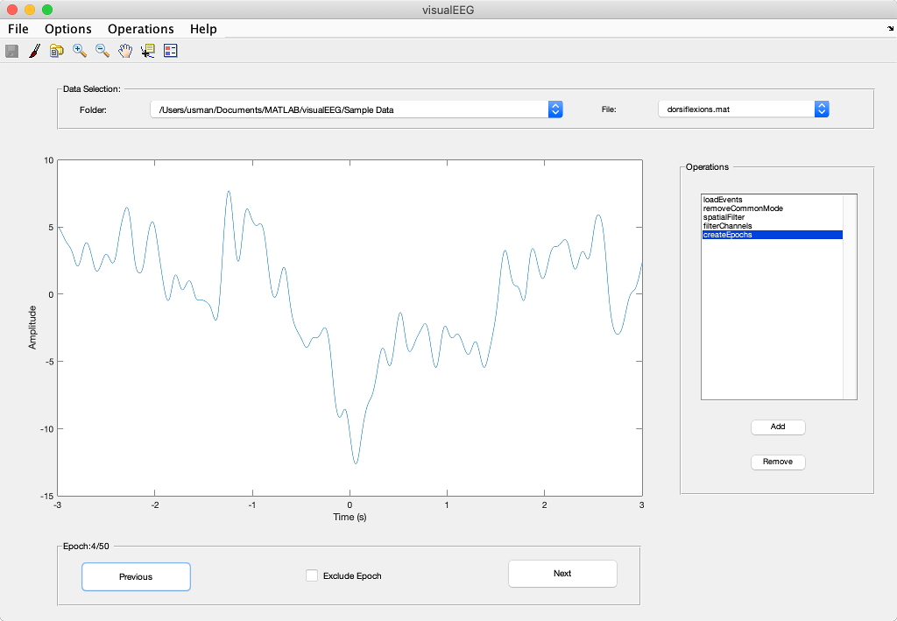
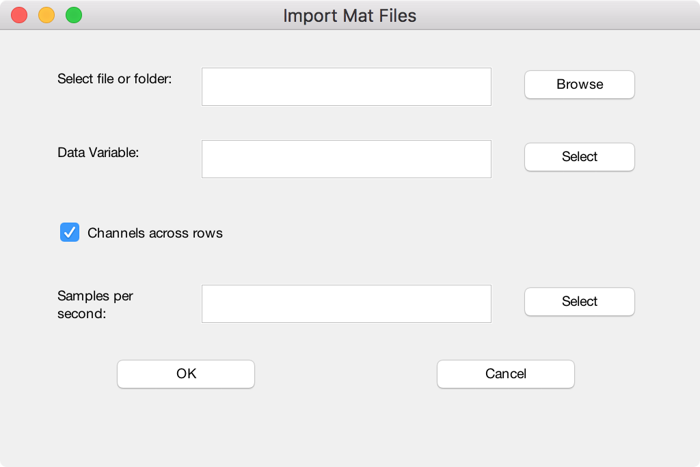
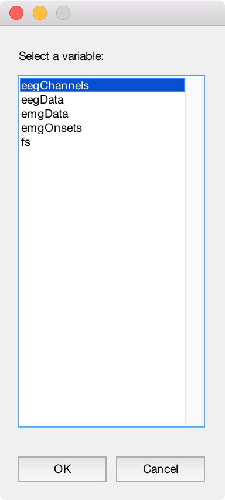
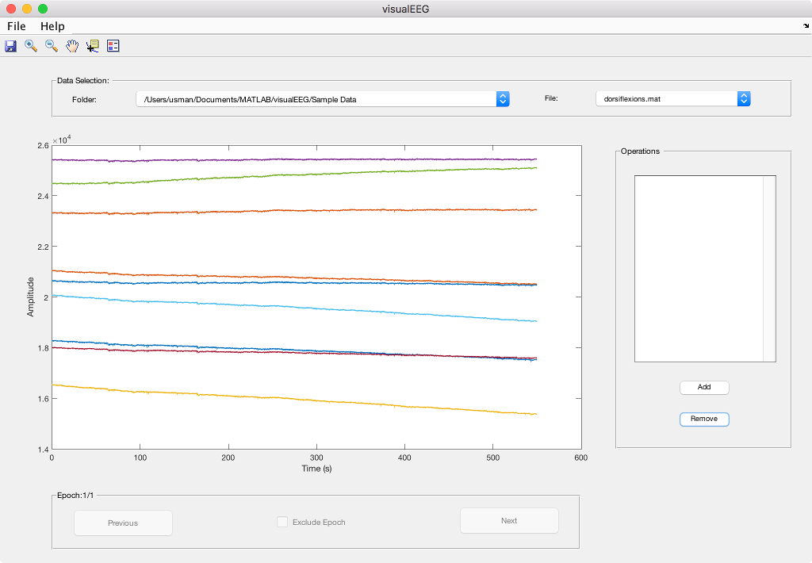

# How to Import Data in visualEEG?

## Contents:

<ul>
    <li>
        <a href="https://github.com/GallVp/visualEEG/tree/master/docs/README.md">Overview of visualEEG</a>
    </li>
    <li>
        <a href="https://github.com/GallVp/visualEEG/tree/master/docs/sampleData.md">Sample Data Explained</a>
    </li>
    <li>
        <a href="https://github.com/GallVp/visualEEG/tree/master/docs/newOperations.md">How to Add New Operations?</a>
    </li>
</ul>

## Steps to import data

1. Open visualEEG by typing visualEEG in MATLAB command window and hit enter. For now, visualEEG only supports importing MATLAB's *MAT* files.

2. From the visualEEG main window, select *Import dataset* from *File* menu. This will open the *Import Mat Files* dialog.

3. visualEEG can import data from both files and folders. In case of folders, make sure all the files have same variable names. To select a file or a folder, click browse. Here, we have selected the *Sample Data* folder.

4. Next, we have to specify the name of the variable which holds the EEG/EMG data as shown in below figure. In case of sample data, the name of the variable which hold the EEG data is named eegData. In case of other datasets, it might be different.

5. Once the correct variable is selected, visualEEG will try to automatically detect the dimention along which the channels are placed. If the channels are placed along columns, mark the *Channels across rows* checkbox manually.

6. The last thing that we have to specify is the sample rate. It can be entered manually or again by selecting an appropriate variable name. In case of folder import, selecting a variable for sample rate is beneficial if different files have data with different sample rates.

7. Once all the options are set, hit *OK*. This completes the data import.

