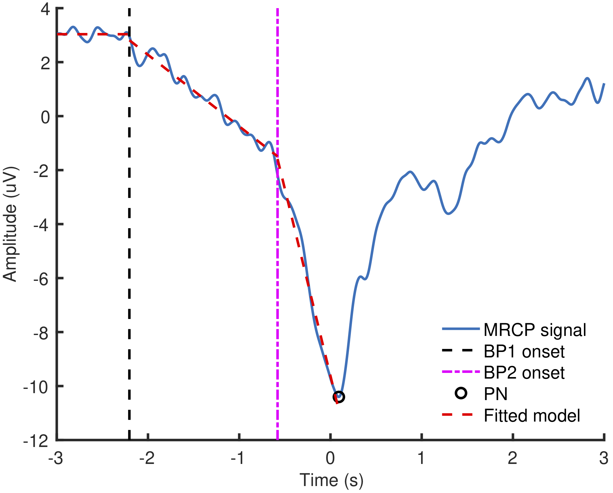

# libMRCP
A small library of functions to process movement-related cortical potentials.

## Automated labelling of Movement-Related Cortical Potentials using Segmented Regression
### Functions
1. `findMRCPFeat`: This function finds the onsets of BP1, BP2 and time of PN with respect to the movement onset, amplitudes at these time points, and slopes for BP1 and BP2.

2. `mrcpBSR`: Performs bounded segmented regression for mrcp segments using particleswarm optimisation. This function is called by `findMRCPFeat`.
### Example
An example averaged MRCP is available in the *Sample Data/dorsiflexions_MRCP.mat* file. This averaged MRCP was obtained from averaging of EEG activity over fifty right foot ballistic dorsiflexions performed by a healthy person. It has following variables
```
averagedMRCP:       MRCP signal
fs:                 Sample-rate
movementOnsetAt:    Time of the movement onset in seconds.
```
Running the `findMRCPFeat(averagedMRCP, fs, movementOnsetAt)` gives following output.

<p align="center">
<hr>
<em>Fig 1. Automated labelling of an example MRCP.</em>
</p>